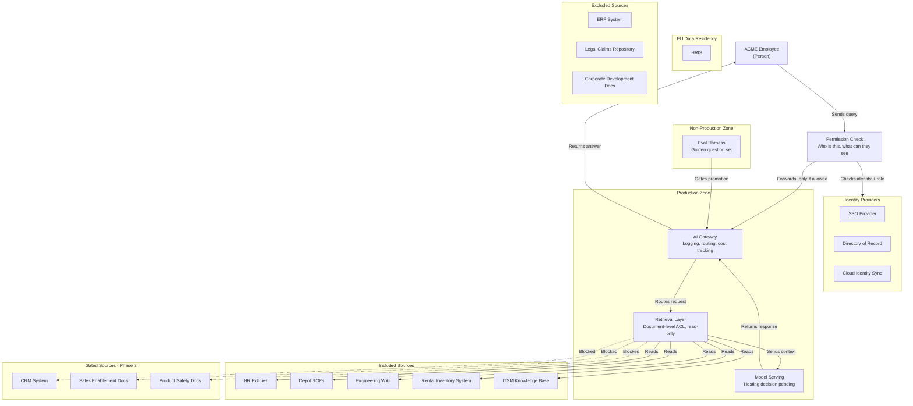

# AskACME — High-Level Architecture (HLA) Package
**Day 2, Deliverable 1** · C4 Container altitude · No product names, per ARB convention
**Rev 2** — permission check moved ahead of the AI Gateway per instructor feedback (see §3)

---

## 1. Diagram

*(Rendered as a flowchart with subgraphs — same container-altitude content the ARB rubric asks for, just a stable Mermaid syntax. Paste into a `.md` file in your repo; GitHub renders Mermaid natively.)*

---

## 2. One-Page Narrative

**Components.** Five containers carry the system now, not four. A **Permission Check** sits in front of everything else — it confirms who the caller is and what role they hold, using the Identity Providers, before the request is allowed to proceed at all. Only then does it reach the **AI Gateway** (logging, routing, per-team cost attribution), the **Retrieval Layer** (document-level ACL enforcement — the model never sees a forbidden chunk), and **Model Serving** (intentionally unnamed at this altitude). An **Eval Harness** sits in a separate Non-Production zone, running the golden question set (normal + honeypot cases) before anything promotes to Production.

**Why permission is checked twice.** This isn't redundant — it's two different questions, answered at two different points, because only one of them can be answered early:
- *"Is this a real, active employee, and what's their role?"* — answerable immediately, at the front door, before any other work happens. A rejected request never touches the Gateway, the Retrieval Layer, or the model.
- *"Can this specific employee see this specific document?"* — only answerable at the Retrieval Layer, because document-level permissions live with the data itself (SharePoint site permissions, Salesforce sharing rules, etc.), not with the identity system.

**Trust boundaries.** Four boundaries now matter: the **Permission boundary** (new — everything before it is unauthenticated/unauthorized, everything after is a checked, role-known request); **Production vs. Non-Production** (SOX-driven — developers cannot deploy their own changes straight to Production); the **EU Data Residency boundary** (GDPR — wraps any source containing EU personal data; currently only the excluded HRIS sits here); and the **document-level ACL boundary** inside Retrieval.

**Data flows.** An employee's query first passes the Permission Check (against Identity Providers). Only allowed requests enter the Production Zone: Gateway → Retrieval Layer (reads only the five **included** pilot sources) → Model Serving → back through the Gateway to the employee. All flows are **read-only** in this phase — per ADR-003, no write/action capability is in scope for the pilot. PartyPal's booking/action role for Events Ops remains untouched and undisplaced by this phase; that gap is logged as a Phase 2 item, not silently absorbed into this architecture.

**Integration points & Day 1 traceability.** Every Day 1 data source is accounted for:

| Status | Sources | Reason |
|---|---|---|
| **Included** | HR Policies, Depot SOPs, Eng Wiki, Rental Inventory System, ITSM KBs | Low-risk, internal classification, no personal data; supports the three pilot use cases |
| **Gated (Phase 2)** | CRM System, Sales Enablement, Product Safety | ACL enforcement unverified; CRM additionally requires an external access grant (est. 4–8 weeks, gated by security review and change-board cadence — not a committed date) |
| **Excluded** | ERP System, Legal/Claims, Corp Dev docs, HRIS | ERP: territorial team, active migration collision. Legal/Claims & Corp Dev: Restricted, honeypot test cases. HRIS: Restricted personal data, also sits inside the EU boundary |

No integration is a "write" action in this phase — the assistant only reads. Where retrieval ends and agency begins is therefore simple for the pilot: it doesn't begin yet.

---

## 3. Revision note (why the order changed)

Original draft had the Gateway authenticate, then forward to Retrieval for ACL enforcement. Instructor feedback: permission should be checked **before** the request enters the Gateway, so the diagram reads cleanly as "check first, then process." Revised design keeps the Retrieval Layer's document-level ACL job (it's the only component with access to document-level classification data) but adds an explicit front-door Permission Check that rejects bad requests before they reach the Gateway, Retrieval, or the model at all.

**Deferred to LLA (next deliverable):** the 5-stage environment promotion path (DEV→SIT→UAT→PREPROD→PROD), specific model-hosting choice, chunking/embedding strategy, and concrete authN/authZ configuration.

**Traceability to ADRs:** Model Serving → ADR-001 (hosting choice, contingent on DPA verification). Retrieval Layer → ADR-002 (ingestion-time tagging, dual refresh cadence). Permission Check → new front-door authorization step, to be formalized as its own ADR candidate if defended before the ARB. Absence of any write relationship in this diagram → ADR-003 (no write access in pilot).
