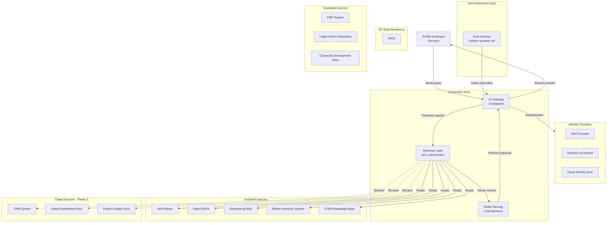

# AskACME — High-Level Architecture (HLA) Package
**Day 2, Deliverable 1** · C4 Container altitude · No product names, per ARB convention

---

## 1. Diagram

*(Note: rendered as a standard flowchart with subgraphs rather than the literal `C4Container` Mermaid command, due to a rendering bug in that command on this platform — confirmed by testing minimal placeholder content, which failed identically. The content still represents container-altitude architecture: boxes are containers/systems, nested groupings are trust boundaries — same substance the ARB rubric asks for, just a more stable notation.)*

*(Paste into a `.md` file in your repo — GitHub renders Mermaid natively. No image export needed, satisfies "rendered from the repo.")*

---

## 2. One-Page Narrative

**Components.** Four containers carry the system: an **AI Gateway** (the mandatory chokepoint — authN, logging, redaction, per-team cost attribution, satisfying the no-shadow-AI and cost-visibility requirements), a **Permission-Aware Retrieval Layer** (enforces Public→Restricted classification at query time — the model never sees a forbidden chunk), **Model Serving** (the LLM itself — intentionally unnamed at this altitude), and an **Eval Harness** sitting in a separate Non-Production zone, running the golden question set (normal + honeypot cases) before anything promotes to Production.

**Trust boundaries.** Three boundaries matter here: **Production vs. Non-Production** (separates the live assistant from where new versions are tested — a SOX-driven line, since developers cannot deploy their own changes straight to Production); the **EU Data Residency boundary** (GDPR — wraps any source containing EU personal data; currently only the excluded HRIS sits here, but the boundary is drawn regardless of current scope so it's structurally ready if that ever changes); and the **Identity boundary**, where the Gateway authenticates every caller before a query reaches retrieval.

**Data flows.** An employee's query passes through the Gateway (authenticated against the identity boundary), into the Retrieval Layer, which reads only from the five **included** pilot sources, then forwards grounded context to Model Serving, and returns an answer back through the Gateway. All flows are **read-only** in this phase — per ADR-003, no write/action capability is in scope for the pilot. This means PartyPal's booking/action role for Events Ops remains untouched and undisplaced by this phase; that gap is logged as a Phase 2 item, not silently absorbed into this architecture.

**Integration points & Day 1 traceability.** Every Day 1 data source is accounted for:

| Status | Sources | Reason |
|---|---|---|
| **Included** | HR Policies, Depot SOPs, Eng Wiki, Rental Inventory System, ITSM KBs | Low-risk, internal classification, no personal data; supports the three pilot use cases |
| **Gated (Phase 2)** | CRM System, Sales Enablement, Product Safety | ACL enforcement unverified; CRM additionally requires an external access grant (est. 4–8 weeks, gated by security review and change-board cadence — not a committed date) |
| **Excluded** | ERP System, Legal/Claims, Corp Dev docs, HRIS | ERP: territorial team, active migration collision. Legal/Claims & Corp Dev: Restricted, honeypot test cases. HRIS: Restricted personal data, also sits inside the EU boundary |

No integration is a "write" action in this phase — the assistant only reads. Where retrieval ends and agency begins is therefore simple for the pilot: it doesn't begin yet.

---

**Deferred to LLA (next deliverable):** the 5-stage environment promotion path (DEV→SIT→UAT→PREPROD→PROD), specific model-hosting choice, chunking/embedding strategy, and concrete authN/authZ configuration.

**Traceability to ADRs:** Model Serving → ADR-001 (hosting choice, contingent on DPA verification). Retrieval Layer → ADR-002 (ingestion-time tagging, dual refresh cadence). Absence of any write relationship in this diagram → ADR-003 (no write access in pilot).
