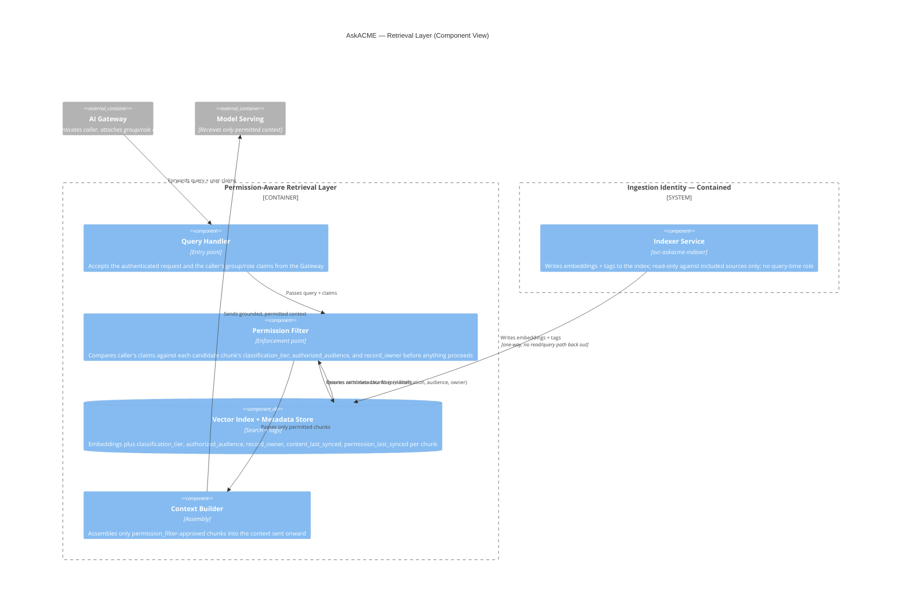

# AskACME — Low-Level Architecture (LLA) Specification
**Day 2, Deliverable 2** · C4 Component altitude · Concrete enough to build against the ACME lab environment

This document assumes the HLA package and ADR-001/002/003 as inputs. Every technology choice below either follows directly from an ADR or is flagged as an open item.

---

## 1. Ingestion & Connectors

One connector per source, each using its own scoped, non-human service identity — not a shared "do everything" account.

| Source | Connector mechanism | Service identity | Scope (least privilege) |
|---|---|---|---|
| HR Policies, Depot SOPs, Eng Wiki (SharePoint) | Graph API pull, scheduled | `svc-askacme-sp-ingest` | `Sites.Selected` — explicitly granted per-site, **not** `Sites.Read.All` (tenant-wide read would break the whole point of least privilege) |
| ArmoryOS | SFTP pull from the existing nightly batch drop, same mechanism ArmoryOS already uses elsewhere | `svc-askacme-armoryos-ingest` | Read-only on the designated export folder only; no SOAP-endpoint write capability granted, consistent with ADR-003 |
| ServiceNow (KB articles only) | REST API pull, scoped to KB records tagged "all employees" | `svc-askacme-snow-ingest` | Read-only, KB table only — explicitly excludes the Incidents table |

**The indexer's identity, named and contained:** all three ingestion connectors funnel into one indexing service, running under its own identity — `svc-askacme-indexer`. This is deliberately a **separate identity from the query-time Gateway/retrieval identity**. Reasoning: the indexer needs broad-enough read access to *build* the index across all included sources; if that same identity were also used to *serve* queries, a bug in query-time logic could accidentally expose everything the indexer can see, defeating ACL enforcement entirely (ADR-002). Containment means: `svc-askacme-indexer` is explicitly **not** granted access to any excluded or gated source (SAP, Workday, Legal/Claims, Corp Dev, Salesforce) at the IAM layer itself — not just blocked in application logic. This is enforced twice (defense in depth): once by what the identity is even allowed to touch, and again by the retrieval layer's own filtering. It goes through the same **quarterly CyberArk access recertification** as ACME's other privileged/service accounts.

**Open item / risk:** ArmoryOS has no known non-production sandbox (it's a 1996 AS/400 system with one contractor, Gene Podowski, who understands it). Ingestion connector testing may need to happen directly against production-adjacent data with heavy masking, or be delayed until a test path is confirmed with Gene. Flagged for the risk register, not resolved here.

## 2. Chunking & Embedding Strategy

- **Document sources** (SharePoint, ServiceNow KBs): standard semantic chunking (paragraph/section-aware, not fixed-character), since these are prose documents.
- **ArmoryOS batch records**: structured-record chunking — one chunk per inventory/refurb record or logical grouping, not prose-style splitting, since the source is tabular batch data, not free text.
- **Metadata schema — every chunk carries:**
  - `source_system`, `classification_tier`, `authorized_audience` (group/role list)
  - `content_last_synced` and `permission_last_synced` — two separate timestamps, per ADR-002
  - `record_owner` (populated where relevant — this field is what Salesforce's future record-level tagging would need to populate correctly before it can leave gated status)
- **Embedding model:** tied to ADR-001's model-hosting decision — if the Azure OpenAI pilot is confirmed, use its embedding model to keep the data path inside the same tenant boundary (no separate egress for embeddings); if the self-hosted fallback triggers, use a self-hosted open-weight embedding model instead. This is a direct dependency, not an independent choice.

## 3. Index & ACL-Enforcement Design

- **Index type:** a vector index with metadata-filtering support, hosted inside the same trust boundary as the model-serving choice (i.e., stays within Production zone from the HLA).
- **Identity flow, end to end** (rubric-required):
  1. Employee authenticates to the Gateway via **Okta SSO** (SAML/OIDC).
  2. Okta's group/role claims are backed by **Entra ID**, which syncs from the **on-prem AD** — the actual source of truth for who's in which group.
  3. The Gateway attaches the authenticated user's group/role claims to the request and forwards it to the Retrieval Layer.
  4. The Retrieval Layer queries the index with a **metadata filter**: return only chunks where `classification_tier` is within the user's clearance **and** `authorized_audience` includes the user's group (and, once Salesforce is unblocked, where `record_owner`/sharing rules match the user).
  5. Only filtered, permitted chunks are passed to Model Serving — never the full unfiltered retrieval set.
- This is the concrete implementation of "the model never sees forbidden chunks" from the HLA.

## 4. Model Serving

Per ADR-001: primary path is the existing Azure OpenAI pilot, pending the bounded 1–2 week DPA/legal status check. Self-hosted open-weight fallback if that check comes back entangled or unresolved. In lower environments (DEV/SIT), model calls run against **masked/synthetic data only** — never live classified content — regardless of which hosting option is ultimately confirmed.

## 5. Application Layer (AI Gateway, detailed)

- **AuthN pass-through:** validates the Okta session before any request reaches retrieval.
- **Logging:** every request logged with requester identity, source(s) retrieved, classification tier(s) touched, and response — feeding Splunk (ACME's existing SIEM), not a new logging system.
- **Redaction:** any accidental leakage patterns (e.g., a chunk that shouldn't have matched) get a last-line redaction check before the response leaves the Gateway — a backstop, not the primary control (the primary control is the retrieval-time filter in Section 3).
- **Cost attribution:** every request tagged by requesting team/department, satisfying Priya's stated veto condition.
- **Budget enforcement:** request-level cost checks reject calls exceeding a team's allocated budget *before* they reach Model Serving — not an after-the-fact bill surprise.

## 6. AuthN/AuthZ Against ACME's Identity Stack

- **Human users:** Okta (SSO/SCIM) as the operational layer, backed by Entra ID synced from on-prem AD as the source of truth. No new identity system introduced.
- **Non-human identities (service accounts):** `svc-askacme-sp-ingest`, `svc-askacme-armoryos-ingest`, `svc-askacme-snow-ingest`, `svc-askacme-indexer` — all managed through **CyberArk**, subject to the same quarterly recertification campaigns as ACME's other privileged accounts. This treats AI-related service accounts as a first-class IAM concern, not a shadow exception.

## 7. Environment Promotion Path (DEV → SIT → UAT → PREPROD → PROD)

| Environment | Data used | Gate to advance |
|---|---|---|
| **DEV** | Synthetic/masked data only | Engineers build freely; no real classified ACME data ever enters DEV |
| **SIT** | Masked data; connectors tested against sandbox/test instances where available (SharePoint test site, Salesforce sandbox); ArmoryOS sandbox availability is the open item flagged in Section 1 | Integration tests pass |
| **UAT** | Limited real, masked-where-possible data; real business users test | Golden question set (including honeypot cases) run for the first time here and must pass |
| **PREPROD** | Production-like configuration | Full eval gate re-run; **SOX separation of duties enforced** — the engineer who built the change cannot be the one who promotes it |
| **PROD** | Live data, live users | Requires an approved **CAB RFC with rollback plan** (dossier constraint #4) — no promotion without it |

Any model version change (Section 4) is treated the same way as a code change — it re-enters this pipeline at PREPROD with the eval gate re-run, not pushed silently.

## 8. Logging & Observability Hooks

- **Per-query audit log:** requester identity, sources retrieved, classification tier(s) touched, both timestamps from Section 2 (content + permission freshness at time of retrieval), and the final response — all to Splunk.
- **Eval/honeypot results:** logged as a compliance artifact at every PREPROD gate and every model version bump — this is the evidence trail an auditor or the CISO could ask for later, not just a pass/fail note in a chat.
- **Cost/attribution logs:** per-team, feeding whatever cost-attribution view Priya's team needs (ties to Section 5).
- **Alerting:** any authorization-test failure (a honeypot case returning content it shouldn't) triggers an immediate alert — treated as a security incident, not a bug ticket, given the honeypot rule's stated severity.

---

## 9. Component Diagram — Permission-Aware Retrieval Layer (C4 Component View)

The written spec above (Sections 1–3) covers all eight required areas at the right level of detail. This diagram makes the **enforcement point and identity flow explicit and visual** for the single container where the rubric scrutinizes it most — the Retrieval Layer — rather than diagramming every section down to code level.

**What this makes explicit that the written spec alone couldn't show as clearly:**
- The **enforcement point** is a single, named component (`Permission Filter`) — not something implied to happen "somewhere" in the layer.
- **Identity flow** continues visually from the Gateway (where auth happens) through to the filter (where it's actually used), rather than just being described in prose.
- The **indexer's identity is drawn as structurally separate** — one-way into the index, no path back out to serve queries — making ADR-002's separation-of-identities argument something a reviewer can see, not just read.

---

**Traceability:** Sections 3–4 and 9 implement ADR-001 and ADR-002 directly. Section 1's identity containment (and its visual counterpart in Section 9) and Section 7's promotion gates are the concrete mechanisms that make ADR-003 (no write access) actually enforceable in practice, not just a policy statement.

**Open items carried to the risk register:** ArmoryOS sandbox availability (Section 1); Salesforce record-owner tagging accuracy, still pending verification before it can leave gated status (Sections 2–3, 9).

