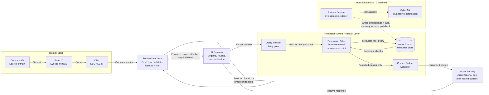

# AskACME — Low-Level Architecture (LLA) Specification
**Day 2, Deliverable 2** · C4 Component altitude · Concrete enough to build against the ACME lab environment
**Rev 2** — aligned to HLA Rev 2: permission/authorization check now happens at a front-door component, before the AI Gateway, not inside it.

This document assumes the HLA package (Rev 2) and ADR-001/002/003 as inputs. Every technology choice below either follows directly from an ADR or is flagged as an open item.

---

## 1. Ingestion & Connectors

One connector per source, each using its own scoped, non-human service identity — not a shared "do everything" account.

| Source | Connector mechanism | Service identity | Scope (least privilege) |
|---|---|---|---|
| HR Policies, Depot SOPs, Eng Wiki (SharePoint) | Graph API pull, scheduled | `svc-askacme-sp-ingest` | `Sites.Selected` — explicitly granted per-site, **not** `Sites.Read.All` (tenant-wide read would break the whole point of least privilege) |
| ArmoryOS | SFTP pull from the existing nightly batch drop, same mechanism ArmoryOS already uses elsewhere | `svc-askacme-armoryos-ingest` | Read-only on the designated export folder only; no SOAP-endpoint write capability granted, consistent with ADR-003 |
| ServiceNow (KB articles only) | REST API pull, scoped to KB records tagged "all employees" | `svc-askacme-snow-ingest` | Read-only, KB table only — explicitly excludes the Incidents table |

**The indexer's identity, named and contained:** all three ingestion connectors funnel into one indexing service, running under its own identity — `svc-askacme-indexer`. This is deliberately a **separate identity from the query-time Gateway/retrieval identity**. Reasoning: the indexer needs broad-enough read access to *build* the index across all included sources; if that same identity were also used to *serve* queries, a bug in query-time logic could accidentally expose everything the indexer can see, defeating ACL enforcement entirely (ADR-002). Containment means: `svc-askacme-indexer` is explicitly **not** granted access to any excluded or gated source (SAP, Workday, Legal/Claims, Corp Dev, Salesforce) at the IAM layer itself — not just blocked in application logic. This is enforced twice (defense in depth): once by what the identity is even allowed to touch, and again by the retrieval layer's own filtering. It goes through the same **quarterly CyberArk access recertification** as ACME's other privileged/service accounts.

**Open item / risk:** ArmoryOS has no known non-production sandbox (it's a 1996 AS/400 system with one contractor, Gene Podowski, who understands it). Ingestion connector testing may need to happen directly against production-adjacent data with heavy masking, or be delayed until a test path is confirmed with Gene. Flagged for the risk register, not resolved here.

## 2. Chunking & Embedding Strategy

- **Document sources** (SharePoint, ServiceNow KBs): standard semantic chunking (paragraph/section-aware, not fixed-character), since these are prose documents.
- **ArmoryOS batch records**: structured-record chunking — one chunk per inventory/refurb record or logical grouping, not prose-style splitting, since the source is tabular batch data, not free text.
- **Metadata schema — every chunk carries:**
  - `source_system`, `classification_tier`, `authorized_audience` (group/role list)
  - `content_last_synced` and `permission_last_synced` — two separate timestamps, per ADR-002
  - `record_owner` (populated where relevant — this field is what Salesforce's future record-level tagging would need to populate correctly before it can leave gated status)
- **Embedding model:** tied to ADR-001's model-hosting decision — if the Azure OpenAI pilot is confirmed, use its embedding model to keep the data path inside the same tenant boundary (no separate egress for embeddings); if the self-hosted fallback triggers, use a self-hosted open-weight embedding model instead. This is a direct dependency, not an independent choice.

## 3. Permission Check — Front-Door Authorization

**This section is new in Rev 2.** Per instructor feedback on the HLA, authorization now happens at a dedicated component *before* the request ever reaches the Gateway — not as a step inside the Gateway. This is the concrete, buildable version of that change.

**Identity flow, end to end (rubric-required):**
1. Employee authenticates to the **Permission Check** component via **Okta SSO** (SAML/OIDC) — this is the front door; nothing downstream runs yet.
2. Okta's group/role claims are backed by **Entra ID**, which syncs from the **on-prem AD** — the actual source of truth for who's in which group.
3. Permission Check validates the session and the caller's role. If the identity is invalid, expired, or holds no recognized role, the request is **rejected here** — it never reaches the Gateway, the Retrieval Layer, or Model Serving. This is the "fail fast, small blast radius" behavior the HLA revision was asking for.
4. If valid, Permission Check attaches the authenticated user's group/role claims to the request and forwards it to the **AI Gateway**.

**What Permission Check does *not* do:** it does not know which specific SharePoint site, ArmoryOS record, or Salesforce record a user can see — that data lives with the source systems, not with identity. Document-level enforcement stays in Section 4, at the Retrieval Layer, which is the only component with access to that metadata. Permission Check answers "is this a real, active employee, and what's their role" — a coarse, fast check — not "can they see this specific chunk."

**Component identity:** Permission Check runs under its own service context, not shared with the Gateway's logging/routing identity, for the same defense-in-depth reasoning as the indexer separation in Section 1. Rejected-request events are logged separately (see Section 9) so a spike in denials is visible on its own, not buried inside Gateway traffic logs.

**Open item:** whether Permission Check is deployed as a standalone service or as a policy layer directly in front of the Gateway's ingress (e.g., an API gateway plugin vs. a separate microservice) is a build-time decision, not yet made. Both satisfy the HLA's "checked before Gateway" requirement; the choice affects only Section 7's promotion mechanics, not the enforcement logic.

## 4. Index & ACL-Enforcement Design (Retrieval Layer — Document-Level)

- **Index type:** a vector index with metadata-filtering support, hosted inside the same trust boundary as the model-serving choice (i.e., stays within Production zone from the HLA).
- **Continuing the identity flow from Section 3:**
  5. The Gateway forwards the already-authenticated request (with attached claims) to the Retrieval Layer.
  6. The Retrieval Layer queries the index with a **metadata filter**: return only chunks where `classification_tier` is within the user's clearance **and** `authorized_audience` includes the user's group (and, once Salesforce is unblocked, where `record_owner`/sharing rules match the user).
  7. Only filtered, permitted chunks are passed to Model Serving — never the full unfiltered retrieval set.
- This is the concrete implementation of "the model never sees forbidden chunks" from the HLA — now explicitly the *second* of two authorization gates, not the only one.

## 5. Model Serving

Per ADR-001: primary path is the existing Azure OpenAI pilot, pending the bounded 1–2 week DPA/legal status check. Self-hosted open-weight fallback if that check comes back entangled or unresolved. In lower environments (DEV/SIT), model calls run against **masked/synthetic data only** — never live classified content — regardless of which hosting option is ultimately confirmed.

## 6. Application Layer (AI Gateway, detailed)

**Changed in Rev 2:** the Gateway no longer performs the primary authentication check — that moved to Permission Check (Section 3). The Gateway now assumes it is only ever receiving requests that already carry validated identity/role claims.

- **Claims pass-through:** trusts and reads the claims attached by Permission Check; does not re-authenticate, but does verify the claims are present and well-formed before routing (a basic integrity check, not a second authorization decision).
- **Logging:** every request logged with requester identity, source(s) retrieved, classification tier(s) touched, and response — feeding Splunk (ACME's existing SIEM), not a new logging system.
- **Redaction:** any accidental leakage patterns (e.g., a chunk that shouldn't have matched) get a last-line redaction check before the response leaves the Gateway — a backstop, not the primary control (the primary control is the retrieval-time filter in Section 4).
- **Cost attribution:** every request tagged by requesting team/department, satisfying Priya's stated veto condition.
- **Budget enforcement:** request-level cost checks reject calls exceeding a team's allocated budget *before* they reach Model Serving — not an after-the-fact bill surprise.

## 7. AuthN/AuthZ Against ACME's Identity Stack

- **Human users:** Okta (SSO/SCIM) as the operational layer, backed by Entra ID synced from on-prem AD as the source of truth. Authentication now happens at Permission Check (Section 3), not the Gateway. No new identity system introduced.
- **Non-human identities (service accounts):** `svc-askacme-sp-ingest`, `svc-askacme-armoryos-ingest`, `svc-askacme-snow-ingest`, `svc-askacme-indexer` — all managed through **CyberArk**, subject to the same quarterly recertification campaigns as ACME's other privileged accounts. This treats AI-related service accounts as a first-class IAM concern, not a shadow exception.

## 8. Environment Promotion Path (DEV → SIT → UAT → PREPROD → PROD)

| Environment | Data used | Gate to advance |
|---|---|---|
| **DEV** | Synthetic/masked data only | Engineers build freely; no real classified ACME data ever enters DEV |
| **SIT** | Masked data; connectors tested against sandbox/test instances where available (SharePoint test site, Salesforce sandbox); ArmoryOS sandbox availability is the open item flagged in Section 1 | Integration tests pass, including Permission Check reject-path tests (invalid/expired session must be denied before reaching the Gateway) |
| **UAT** | Limited real, masked-where-possible data; real business users test | Golden question set (including honeypot cases) run for the first time here and must pass |
| **PREPROD** | Production-like configuration | Full eval gate re-run; **SOX separation of duties enforced** — the engineer who built the change cannot be the one who promotes it |
| **PROD** | Live data, live users | Requires an approved **CAB RFC with rollback plan** (dossier constraint #4) — no promotion without it |

Any model version change (Section 5) is treated the same way as a code change — it re-enters this pipeline at PREPROD with the eval gate re-run, not pushed silently. The same applies to any change in Permission Check's role-mapping logic — a role definition change is as consequential as a model version bump and goes through the identical gate.

## 9. Logging & Observability Hooks

- **Per-query audit log:** requester identity, sources retrieved, classification tier(s) touched, both timestamps from Section 2 (content + permission freshness at time of retrieval), and the final response — all to Splunk.
- **Permission Check denial log (new in Rev 2):** every rejected request logged separately from Gateway traffic — requester identity (if resolvable), reason for denial (invalid session, unrecognized role, expired token), and timestamp. A spike here is a signal worth its own alert, independent of Gateway volume.
- **Eval/honeypot results:** logged as a compliance artifact at every PREPROD gate and every model version bump — this is the evidence trail an auditor or the CISO could ask for later, not just a pass/fail note in a chat.
- **Cost/attribution logs:** per-team, feeding whatever cost-attribution view Priya's team needs (ties to Section 6).
- **Alerting:** any authorization-test failure (a honeypot case returning content it shouldn't) triggers an immediate alert — treated as a security incident, not a bug ticket, given the honeypot rule's stated severity.

---

## 10. Component Diagram — Permission Check & Permission-Aware Retrieval Layer (C4 Component View)

The written spec above (Sections 1–4) covers all required areas at the right level of detail. This diagram makes the **two enforcement points and the identity flow explicit and visual** — Permission Check at the front door, and the Retrieval Layer's document-level filter deeper in — rather than diagramming every section down to code level.

*(Rendered as a flowchart with subgraphs, same reasoning as the HLA diagram. Model Serving is named concretely here per ADR-001, since LLA is the altitude for real technology selections — unlike the HLA, which stays generic by convention. The Vector Index remains intentionally unnamed: no specific product has actually been selected yet, and naming one here would misrepresent an undecided choice as a decision.)*

**What this makes explicit that the written spec alone couldn't show as clearly:**
- There are now **two enforcement points**, not one: Permission Check (coarse, role-level, at the front door) and the Permission Filter inside Retrieval (fine-grained, document-level). A reviewer can see both, and see that a rejected request at the front door never reaches the second one.
- **Identity flow** continues visually from Okta, through Permission Check, through the Gateway, to the filter — rather than just being described in prose.
- The **indexer's identity is drawn as structurally separate** — one-way into the index, no path back out to serve queries — making ADR-002's separation-of-identities argument something a reviewer can see, not just read.

---

**Traceability:** Section 3 implements the HLA Rev 2 revision directly and is a candidate for its own ADR if defended before the ARB (front-door authorization vs. authorization-inside-gateway is a real architectural choice with trade-offs worth recording). Sections 4–5 and 10 implement ADR-001 and ADR-002 directly. Section 1's identity containment (and its visual counterpart in Section 10) and Section 8's promotion gates are the concrete mechanisms that make ADR-003 (no write access) actually enforceable in practice, not just a policy statement.

**Open items carried to the risk register:** ArmoryOS sandbox availability (Section 1); whether Permission Check is a standalone service or an API-gateway policy layer (Section 3); Salesforce record-owner tagging accuracy, still pending verification before it can leave gated status (Sections 2, 4, 10).
